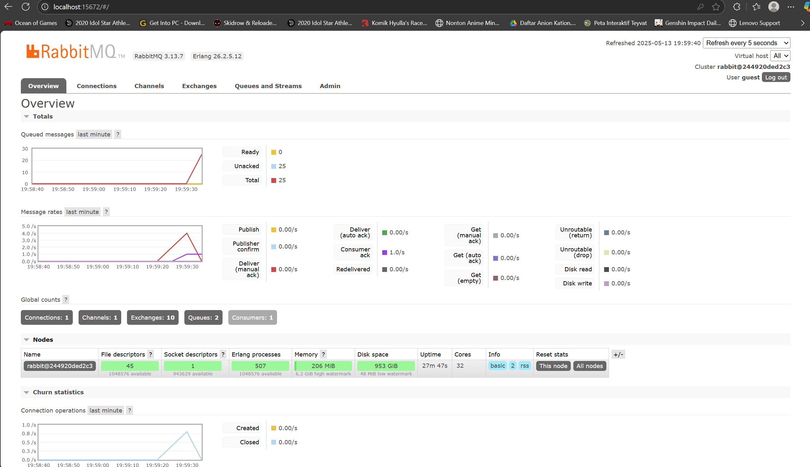

# Tutorial 9 Event-Driven Architecture

Name: Belva Ghani Abhinaya

Class: Advance Programming B

Student Number: 2306203526

<details>
<summary><b>Reflection on Module 9</b></summary>
<br>

### Reflection 1 for Subscriber

#### a. What is AMQP?

Advanced Message Queuing Protocol (AMQP) is an open standard application layer protocol for message-oriented middleware. It defines a binary protocol and set of behaviors for messaging between systems, ensuring reliable, interoperable communication through concepts like exchanges, queues, and routing. AMQP supports features such as message acknowledgments, transactions, and flexible routing, making it suitable for distributed, event-driven architectures.

#### b. What does `guest:guest@localhost:5672` mean?

The string follows the URI format for connecting to a RabbitMQ broker:

```
amqp://<username>:<password>@<host>:<port>
```

* **First `guest`**: the username used to authenticate with RabbitMQ (default account provided by the broker).
* **Second `guest`**: the password associated with that username.
* **`localhost`**: the hostname or IP address of the RabbitMQ server (in this case, the local machine).
* **`5672`**: the default TCP port on which RabbitMQ listens for AMQP connections.

Putting it all together, `guest:guest@localhost:5672` tells the client to connect over AMQP to a broker running on the local machine at port 5672 using the `guest` account.

#### c. RabbitMQ Queue Overview


On my machine, the Total queued messages is 25 (0 Ready, 25 Unacked).
This is because I ran the publisher five times while the subscriber was offline, so each run added 5 messages that piled up unacknowledged (5 events × 5 runs = 25). If you start (or restart) the subscriber, you’ll see the queue total drop back down to zero as it consumes—and acknowledges—all of them.

</details>